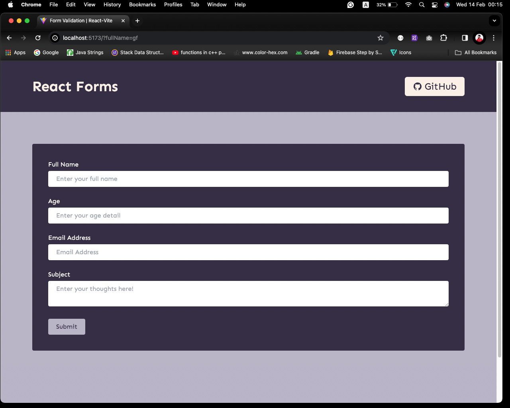
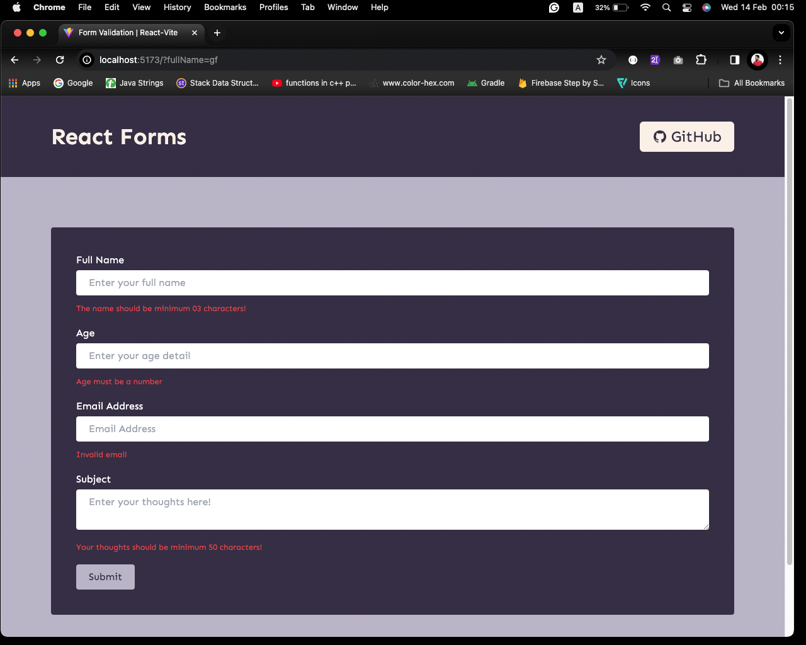
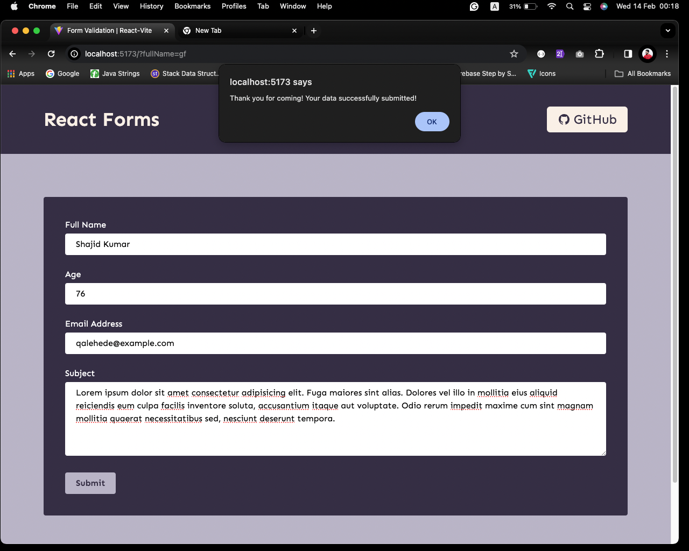

# Cyberdude Challenges - React Js

## Task 05: Create Form with React Validation

Create a form and do the data validation using React-Hook-Form

### Live link

https://react-form-validation-react-hook-form.netlify.app/

## Technologies and Libraries Used and Learned

| S.No | Technologies and Libraries Used                                          |
| :--- | ------------------------------------------------------------------------ |
| 01   | [React Js](https://www.youtube.com/live/Yc8JxiCdNQE?si=kTkPpKa5uqfLubpC) |

### Screenshots







## Installation

- Clone the Repo into Local machine

```bash
  git clone https://github.com/Mushkir/react-form-validation-react-hook-form.git

```

- Open the terminal and enter following command

```bash
npm install
```

- If you are a Mac user try the following command

```bash
sudo npm install
```

- Enter the following command to Run

```bash
npm run dev
```

## Internship

This internship is provided by [CyberDude Networks Pvt. Ltd.](https://youtube.com/cyberdudenetworks) as part of the 6-Month Free Internship program, a skill development initiative organized to enhance participants' skills. Mentoring was provided by [Mr. Anbuselvan Rocky](https://instagram.com/anbuselvanrocky). For more information, [you can contact CyberDude Networks here](https://cyberdudenetworks.com).

### License: MIT (Do whatever, you want!)

### Acknowledgment:

- [Anbuselvan Rocky](https://fb.me/anburocky3)
